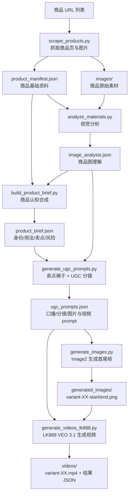

# Product UGC Pipeline

一个面向跨境电商商品的 AI UGC 短视频生产 Skill：输入商品链接，自动沉淀商品资料、理解商品外观与用法、提炼核心卖点、生成 UGC 脚本与首尾帧，并调用 VEO 生成可追溯的竖屏带货短视频。

> 一句话：把“商品 URL”批量转化为“商品理解文档 + 卖点脚本 + 首尾帧 + VEO 短视频”的 AI 生产流水线。

## 项目价值

传统商品短视频生产通常需要人工完成商品图筛选、卖点理解、脚本撰写、图片参考、视频模型调用和文件整理；多商品、多轮追加时尤其容易出现 prompt 分散、参考图错误、产品外观漂移、视频成片不可追溯等问题。

`product-ugc-pipeline` 将这套流程沉淀成可复用的 Codex Skill，重点解决四类问题：

- **批量生产**：支持多商品 URL 批量抓取、分析、生成 prompt、首尾帧和视频。
- **核心卖点**：先构建 `benefit_ladder`，再写口播、分镜和 VEO prompt，避免只讲“怎么用”却没讲“为什么买”。
- **产品一致性**：通过参考图锁定、幻觉防御、首尾帧连续性和模型约束，减少产品形状、材质、配件、用法漂移。
- **资产可追溯**：每个商品都有独立文件夹，保留 `manifest / image_analysis / product_brief / ugc_prompts / generated_images / videos` 等完整链路。

## 量化结果

截至 2026-06-29，本项目本地生产数据已固化到线上证据文件：

- Canonical 历史视频：**230 个 MP4**
- Prompt 变体：**227 条**
- 已建档商品目录：**37 个**
- 生成图片素材：**496 张**
- 视频任务明确终态成功率：**约 97.2%**
- Skill 迭代提交：**41 次**

查看完整案例与统计：

- [量化案例文档](docs/evidence/product_ugc_skill_case_20260629.md)
- [统计 JSON](docs/evidence/product_ugc_skill_stats_20260629.json)

## 核心流程



## 产物目录

默认每个商品会形成一个独立目录：

```text
product-ugc-output/
└── 01-product-name/
    ├── product_manifest.json       # 商品标题、链接、卖点、图片来源
    ├── materials.md                # 人类可读的素材记录
    ├── images/                     # 原始商品图
    ├── image_analysis.json         # 视觉模型分析结果
    ├── product_brief.json          # 商品身份、用法、卖点、误用风险
    ├── ugc_prompts.json            # canonical prompt 文件
    ├── generated_images/           # 首尾帧或垫图
    │   ├── variant-01-start.png
    │   └── variant-01-end.png
    ├── videos/                     # canonical 视频输出
    │   ├── variant-01.mp4
    │   └── video_generation_results.json
    └── runs/                       # 可选：批次历史与中间结果
```

## 快速开始

### 1. 准备商品链接

创建 `urls.txt`，每行一个商品 URL：

```text
https://example.com/products/product-a
https://example.com/products/product-b
```

### 2. 配置 API Key

按需设置环境变量，不要把真实 key 写进仓库：

```bash
export LAOZHANG_API_KEY="sk-..."
export LK888_API_KEY="sk-..."
export MINIMAX_API_KEY="sk-..."
```

常见用途：

- `LAOZHANG_API_KEY`：商品图视觉分析、product brief、Image2 图片生成等。
- `LK888_API_KEY`：默认 VEO 3.1 视频生成通道。
- `MINIMAX_API_KEY`：当视觉/文本模型需要备用通道时使用。

### 3. 运行完整流水线

```bash
python scripts/scrape_products.py urls.txt --out product-ugc-output

LAOZHANG_API_KEY=$LAOZHANG_API_KEY \
python scripts/analyze_materials.py product-ugc-output

LAOZHANG_API_KEY=$LAOZHANG_API_KEY \
python scripts/build_product_brief.py product-ugc-output

LAOZHANG_API_KEY=$LAOZHANG_API_KEY \
python scripts/generate_ugc_prompts.py product-ugc-output --count 10

LAOZHANG_API_KEY=$LAOZHANG_API_KEY \
python scripts/generate_images.py product-ugc-output \
  --variants 1-10 \
  --model gpt-image-2-vip \
  --size 1024x1536 \
  --keyframes

LK888_API_KEY=$LK888_API_KEY \
python scripts/generate_videos_lk888.py product-ugc-output \
  --variants 1-10 \
  --model veo3.1 \
  --generation-mode fast \
  --base-url https://api.lk888.ai \
  --status-endpoint /v1/media/status
```

### 4. 追加新版本

如果一个商品已经生成过视频，后续想“再来几个新版本”，建议走 fresh batch：

```bash
LAOZHANG_API_KEY=$LAOZHANG_API_KEY LK888_API_KEY=$LK888_API_KEY \
python scripts/run_fresh_batch.py product-ugc-output \
  --products 01 \
  --count 2 \
  --batch-label 20260630-refresh
```

追加时会优先复用原商品目录和历史 prompt，避免重复旧场景、旧卖点、旧分镜。

## 核心能力

### 1. 商品认知链路

项目不会直接拿商品标题硬写视频，而是通过三层认知构建：

1. `product_manifest.json`：商品页标题、URL、描述、卖点、图片来源。
2. `image_analysis.json`：视觉模型判断真实产品外观、结构、参考图价值和误用风险。
3. `product_brief.json`：综合商品页与视觉分析，形成产品身份、使用步骤、证明镜头和安全卖点。

### 2. 核心卖点梯子

每条 UGC 变体都会先构建 `benefit_ladder`：

- `core_selling_claim`：买家为什么要买。
- `buyer_problem`：买家痛点、担忧或欲望。
- `product_intervention`：产品如何介入解决问题。
- `buyer_result`：买家能看到或感受到的结果。
- `proof_moment`：视频里能证明卖点的镜头。

这样可以减少“视频很好看但没抓住卖点”的情况。

### 3. 产品一致性与防幻觉

Skill 会向图片和视频 prompt 注入产品保真规则：

- 禁止凭空添加线缆、按钮、盖子、容器、标签、配件。
- 保持产品形状、比例、颜色、材质和关键功能区。
- 避免错误 SKU、包装图、配件图、局部图成为 canonical reference。
- 对手机、充电、佩戴、开合等场景加入物理合理性约束。
- VEO 生产默认使用 LK888 `veo3.1`，不静默切到非 VEO 模型。

### 4. 首尾帧控制

默认使用 start/end keyframes 控制 VEO：

- 首帧对应 0–2 秒 hook 或问题场景。
- 尾帧对应最终结果或 proof moment。
- 尾帧通常基于首帧 + 商品参考图生成，保持同一人物、场景、光线和机位。

这比单张垫图更适合展示产品使用过程，也能减少视频中途漂移。

### 5. 文件与版本管理

- prompt 统一追加到 `ugc_prompts.json`。
- 视频统一输出为 `videos/variant-XX.mp4`。
- 批次历史保留到 `runs/`。
- Skill 自身使用 Git 管理，每次规则升级都可追溯。

## 脚本说明

| 脚本 | 作用 |
|---|---|
| `scripts/scrape_products.py` | 根据商品 URL 抓取商品基础信息和商品图 |
| `scripts/analyze_materials.py` | 调用视觉模型分析商品图片 |
| `scripts/build_product_brief.py` | 生成产品认知、用法、卖点、误用风险 |
| `scripts/generate_ugc_prompts.py` | 生成 UGC 口播、分镜、图片 prompt、视频 prompt |
| `scripts/generate_images.py` | 调用 Image2 生成首尾帧或垫图 |
| `scripts/generate_videos_lk888.py` | 调用 LK888/updrama VEO 生成视频 |
| `scripts/generate_videos.py` | 调用 LaoZhang VEO，显式需要时使用 |
| `scripts/run_fresh_batch.py` | 追加新版本的推荐入口 |
| `scripts/common.py` | 公共请求、文件、选择器工具 |

## 质量门禁

生产流程采用 fail-fast 原则：

- 视觉分析失败，不继续生成 brief。
- 商品认知缺失，不继续生成 prompt。
- prompt 没有产品保真和卖点梯子，不继续生成首尾帧。
- 首尾帧或参考图不可信，不继续付费跑视频。
- VEO 通道失败时记录错误，不静默切换模型。

## 推荐核查入口

- [Skill 规则文档](SKILL.md)
- [核心 Prompt 生成脚本](scripts/generate_ugc_prompts.py)
- [LK888 VEO 生成脚本](scripts/generate_videos_lk888.py)
- [量化案例文档](docs/evidence/product_ugc_skill_case_20260629.md)
- [统计 JSON](docs/evidence/product_ugc_skill_stats_20260629.json)
- [GitHub Commit 时间线](https://github.com/peipeijiang/product-ugc-pipeline/commits/main/)

## 注意事项

- 不要把任何真实 API key、账号 token 或下载私链提交到仓库。
- 生成视频前要确认商品认知、参考图和 prompt 都可信。
- 如果视频模型把产品形状改错，优先检查 canonical reference 和 `product_brief.json`，不要盲目重跑。
- 如果要临时使用非 VEO 模型，必须在任务说明中显式指定，不允许生产默认静默 fallback。

## 安全说明

本仓库已按公开上传口径整理：真实 API Key、生成视频、图片大文件、缓存、日志、本地运行产物均不应提交到 GitHub。`.gitignore` 已排除常见媒体文件、输出目录、环境变量文件和本地索引缓存。

## License

当前仓库用于个人/团队内部 AI 商品 UGC 生产流程沉淀。如需对外开源或商用，请先补充明确 License。
