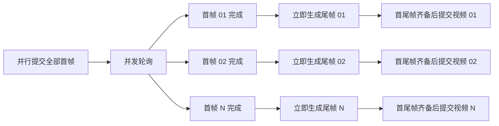
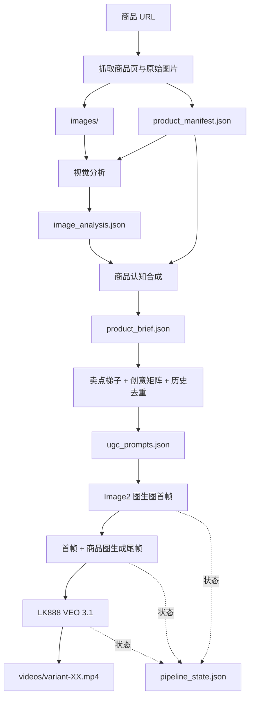

[简体中文](README.md) | [English](README_EN.md)

把商品链接转化为**商品认知文档、差异化 UGC 脚本、产品一致的首尾帧和可追溯短视频**的 AI 生产流水线。

`product-ugc-pipeline` 是一个面向跨境电商和短视频带货的 Codex Skill。它不是简单地“看标题写 prompt”，而是先理解商品的真实外观、使用方式和核心卖点，再围绕买家问题、产品介入和可见结果设计广告剧情，最后通过 Image2 与 VEO 批量生成素材。

## 为什么需要它

批量制作商品视频时，真正困难的通常不是调用模型，而是稳定地解决这些问题：

- 商品图很多，但不一定都适合作为产品身份参考。
- 模型容易误解产品功能，添加不存在的线缆、按钮、配件或动作。
- 多条视频看似不同，实际只是同一套分镜换了几句话。
- 首尾帧人物、场景和产品不连续，导致视频中途变形。
- 追加视频时 prompt、图片、任务状态和成片散落在多个目录。
- 视频任务异步排队，串行等待会浪费大量时间。

本项目把这些经验沉淀成一套可复用、可恢复、可审计的生产流程。

## 核心能力

### 1. 商品认知，而不是标题猜测

流水线通过三层结构逐步建立商品事实：

1. `product_manifest.json`：保存商品标题、来源 URL、页面卖点和原始图片。
2. `image_analysis.json`：识别真实外观、结构、功能面、参考图价值和潜在误用。
3. `product_brief.json`：汇总商品身份、使用步骤、核心卖点、证明镜头和幻觉风险。

任何关键认知步骤失败时，生产流程会立即停止，不会用人工拼凑的假数据继续消耗图片或视频额度。

### 2. 围绕核心卖点写广告

每条视频先构建 `benefit_ladder`：

- `core_selling_claim`：买家最重要的购买理由。
- `buyer_problem`：真实痛点、担忧或欲望。
- `product_intervention`：产品如何正确介入。
- `buyer_result`：买家能够看见或感受到的结果。
- `proof_moment`：画面中用于证明卖点的关键瞬间。

口播、分镜、首尾帧和视频 prompt 都围绕同一个商业主线生成，避免“只展示产品，却没有购买理由”。

### 3. 创意矩阵与历史去重

同一批视频可以共享核心卖点，但不能共享同一套广告剧情。创意矩阵会主动拉开以下维度：

- Hook 类型
- 买家场景
- 创作者人设
- 故事结构
- 证明方式
- 镜头语言
- 节奏与情绪
- 产品功能焦点

追加新版本时，模型会读取历史 `ugc_prompts.json`，避免把旧场景、旧动作和旧台词换词重写。

### 4. 产品一致性与通用防幻觉

图片和视频 prompt 会自动注入产品保真约束：

- 锁定轮廓、比例、颜色、材质、纹理和关键功能区。
- 禁止凭空添加线缆、按钮、容器、盖子、支架或包装。
- 禁止产品执行参考图和商品认知中未支持的动作。
- 使用手、手机和环境物体作为真实尺寸锚点。
- 对佩戴、充电、开合、磁吸、拉环等动作增加物理合理性约束。

产品参考图只锁定**产品身份**，不会把原商品图的背景、桌面、灯光和构图也机械复制到所有广告里。

### 5. 首尾帧连续性

首帧对应视频的开场问题或 Hook，尾帧对应结果或证明镜头。尾帧必须使用**首帧 + 商品参考图**继续生成，从而保持：

- 同一人物
- 同一服装
- 同一场景
- 同一光线
- 同一机位关系
- 同一产品外观

首尾帧需要有明确的剧情变化，但不能像两次互不相关的拍摄。

### 6. 并行异步生产

图片与视频任务采用“并行提交 + 完成即级联”的方式：



任务 ID 和阶段状态写入 `pipeline_state.json`。进程中断后可继续轮询，不会重复提交已完成任务。

## 完整工作流



## 快速开始

### 1. 准备商品链接

创建 `urls.txt`，每行一个商品 URL：

```text
https://example.com/products/product-a
https://example.com/products/product-b
```

### 2. 配置密钥

真实 API Key 只通过环境变量传入，不要写入仓库：

```bash
export LAOZHANG_API_KEY="sk-..."
export LK888_API_KEY="sk-..."
```

### 3. 构建商品认知

```bash
python scripts/scrape_products.py urls.txt --out product-ugc-output

LAOZHANG_API_KEY=$LAOZHANG_API_KEY \
python scripts/analyze_materials.py product-ugc-output

LAOZHANG_API_KEY=$LAOZHANG_API_KEY \
python scripts/build_product_brief.py product-ugc-output
```

### 4. 生成脚本与首尾帧

```bash
LAOZHANG_API_KEY=$LAOZHANG_API_KEY \
python scripts/generate_ugc_prompts.py product-ugc-output --count 10

LAOZHANG_API_KEY=$LAOZHANG_API_KEY \
python scripts/generate_images.py product-ugc-output \
  --variants 1-10 \
  --model gpt-image-2-vip \
  --size 1024x1536 \
  --keyframes
```

### 5. 使用 VEO 生成视频

生产默认使用 LK888/updrama `veo3.1`，不会静默切换到其他视频模型：

```bash
LK888_API_KEY=$LK888_API_KEY \
python scripts/generate_videos_lk888.py product-ugc-output \
  --variants 1-10 \
  --model veo3.1 \
  --generation-mode fast
```

### 6. 并行运行图片到视频链路

```bash
LK888_API_KEY=$LK888_API_KEY \
python scripts/parallel_pipeline.py product-ugc-output/01-product-name \
  --variants 1-10 \
  --video-model veo3.1 \
  --duration 8
```

该入口会读取商品目录内已有的 `ugc_prompts.json` 与商品参考图，自动提交首帧、基于首帧生成尾帧，并在每组首尾帧完成后提交对应视频。

### 7. 在原商品目录追加新版本

```bash
LAOZHANG_API_KEY=$LAOZHANG_API_KEY \
LK888_API_KEY=$LK888_API_KEY \
python scripts/run_fresh_batch.py product-ugc-output \
  --products 01 \
  --count 2 \
  --batch-label 20260709-refresh
```

新版本会递增 `variant_id`，追加到统一的 prompt 和视频目录，不覆盖旧素材。

## 产物目录

```text
product-ugc-output/
└── 01-product-name/
    ├── product_manifest.json
    ├── materials.md
    ├── images/
    ├── image_analysis.json
    ├── product_brief.json
    ├── ugc_prompts.json
    ├── pipeline_state.json
    ├── generated_images/
    │   ├── variant-01-start.png
    │   └── variant-01-end.png
    ├── videos/
    │   ├── variant-01.mp4
    │   └── video_generation_results.json
    └── runs/
        └── 20260709-refresh/
```

## 主要脚本

| 脚本 | 作用 |
|---|---|
| `scripts/scrape_products.py` | 抓取商品资料与原始图片 |
| `scripts/analyze_materials.py` | 视觉分析商品外观、结构和参考图价值 |
| `scripts/build_product_brief.py` | 合成商品身份、用法、卖点和风险 |
| `scripts/generate_ugc_prompts.py` | 生成卖点驱动、历史感知的 UGC prompt |
| `scripts/generate_images.py` | 使用 Image2 生成产品一致的首尾帧 |
| `scripts/generate_videos_lk888.py` | 使用 LK888/updrama VEO 生成视频 |
| `scripts/parallel_pipeline.py` | 并行轮询并自动级联首帧、尾帧和视频 |
| `scripts/run_fresh_batch.py` | 在原商品目录追加新批次 |
| `scripts/generate_videos.py` | 显式需要时使用 LaoZhang VEO |

## 质量门禁

生产流程遵循 fail-fast 原则：

- 视觉分析存在错误时，不生成商品 brief。
- 商品身份、用法或误用风险缺失时，不生成 prompt。
- 核心卖点、证明镜头或产品保真规则缺失时，不生成首尾帧。
- 首尾帧不符合商品外观或剧情连续性时，不提交付费视频任务。
- VEO 通道失败、余额不足或超时时，记录原始错误，不静默更换模型。
- 8 秒与 10 秒视频分别使用对应口播字数预算，避免结尾台词说不完。
- 禁止字幕、平台图标和社交媒体 UI；仅允许少量、非字幕式的功能标签。

## 已验证产出

截至 `2026-06-29` 的审计快照：

| 指标 | 数量 |
|---|---:|
| Canonical 视频 | 230 |
| Prompt 变体 | 227 |
| 商品目录 | 37 |
| 生成图片 | 496 |
| 明确终态视频成功率 | 约 97.2% |

核查材料：

- [量化案例](docs/evidence/product_ugc_skill_case_20260629.md)
- [PDCA 复盘](docs/evidence/product_ugc_skill_pdca_20260630.md)
- [统计快照](docs/evidence/product_ugc_skill_stats_20260629.json)
- [GitHub 提交时间线](https://github.com/peipeijiang/product-ugc-pipeline/commits/main/)

## 安全与模型策略

- 不提交真实 API Key、临时下载地址、生成媒体、缓存或日志。
- Codex 直接负责编写 prompt；外部模型用于视觉分析和媒体生成，不用于替代本地创意决策。
- 默认视频模型是 LK888 `veo3.1`。
- 只有用户明确指定或批准时，才使用 Omni Flash、Sora、Seedance、Kling 或其他非默认模型。
- 图片优先使用图生图路径，商品参考图必须真实、完整地反映产品外观。

## 文档

- [Skill 完整规则](SKILL.md)
- [Skill 简介](SKILL_INTRO.md)
- [版本管理约定](VERSIONING.md)
- [API 接入笔记](references/laozhang-api-notes.md)

## License

当前仓库用于个人和团队的 AI 商品 UGC 生产流程沉淀。若计划公开发行或商用，请先补充明确的开源许可证。
