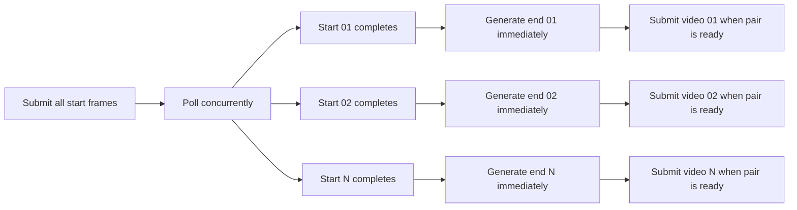
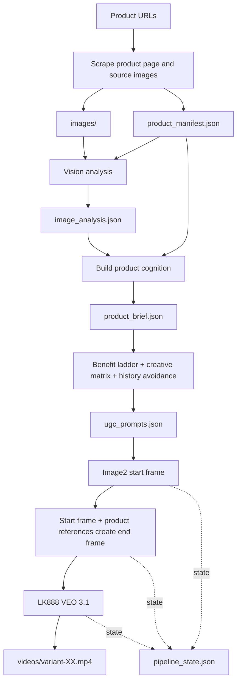

[简体中文](README.md) | [English](README_EN.md)

An AI production pipeline that turns ecommerce product URLs into **structured product intelligence, differentiated UGC scripts, product-faithful keyframes, and traceable short-form videos**.

`product-ugc-pipeline` is a Codex Skill for cross-border ecommerce and creator-style product ads. Instead of guessing from a product title, it first establishes the product's real appearance, usage mechanics, and commercial promise. It then designs buyer-centered ad concepts and generates reference images with Image2 and production videos with VEO.

## Why This Exists

The difficult part of scaling product video production is not the API call itself. It is keeping the full chain reliable:

- Product pages contain many images, but only some are valid identity references.
- Models may invent cables, buttons, accessories, mechanisms, or unsupported actions.
- A batch may contain ten prompts that are merely rewrites of the same ad.
- Start and end frames may change the person, room, camera, or product geometry.
- Incremental batches often scatter prompts, images, task states, and videos across folders.
- Serial polling wastes time when image and video providers are asynchronous.

This repository turns those production lessons into a reusable, resumable, and auditable workflow.

## Core Capabilities

### 1. Product cognition before generation

The pipeline builds product facts in three layers:

1. `product_manifest.json` stores the source URL, title, page claims, and original images.
2. `image_analysis.json` identifies product geometry, functional surfaces, reference value, and misuse risks.
3. `product_brief.json` consolidates identity, usage steps, selling points, proof moments, and hallucination defenses.

If a required cognition stage fails, the pipeline stops instead of fabricating placeholder data and spending media-generation credits.

### 2. Ads built around the buying reason

Every variant starts with a `benefit_ladder`:

- `core_selling_claim`: the primary reason to buy.
- `buyer_problem`: the desire, frustration, or concern that creates demand.
- `product_intervention`: the supported product action.
- `buyer_result`: the visible or spoken outcome.
- `proof_moment`: the shot that makes the promise believable.

Voiceover, storyboard, keyframes, and the final video prompt share the same commercial spine.

### 3. Creative matrix and history awareness

Variants may share one core promise, but they should not share one ad formula. The creative matrix deliberately varies:

- Hook archetype
- Buyer context
- Creator persona
- Story shape
- Proof style
- Camera language
- Pace and emotion
- Primary function focus

When a product receives another batch, historical `ugc_prompts.json` variants are read as concepts to avoid rather than templates to paraphrase.

### 4. Product fidelity and universal hallucination defense

Image and video prompts automatically enforce:

- Stable silhouette, proportions, color, material, texture, and functional surfaces.
- No invented cables, buttons, containers, lids, stands, packaging, or accessories.
- No actions unsupported by the product references and product brief.
- Realistic scale anchored to hands, phones, furniture, and nearby objects.
- Physically valid charging, wearing, folding, magnetic, ring, and attachment behavior.

Product references lock the **product identity**, not the original product-photo background or composition.

### 5. Continuous start and end frames

The start frame represents the opening problem or hook. The end frame represents the final result or proof. The end frame is generated from the **start frame plus canonical product references**, preserving:

- The same person
- The same wardrobe
- The same room
- The same lighting
- The same camera geometry
- The same product

The two frames must show meaningful story progression without looking like unrelated shoots.

### 6. Parallel asynchronous production

The media pipeline uses parallel submission and completion-driven cascading:



Task IDs and phase states are stored in `pipeline_state.json`, so interrupted runs can resume without resubmitting completed work.

## End-to-End Workflow



## Quick Start

### 1. Prepare product URLs

Create `urls.txt` with one URL per line:

```text
https://example.com/products/product-a
https://example.com/products/product-b
```

### 2. Configure credentials

Pass real API keys through environment variables only:

```bash
export LAOZHANG_API_KEY="sk-..."
export LK888_API_KEY="sk-..."
```

### 3. Build product cognition

```bash
python scripts/scrape_products.py urls.txt --out product-ugc-output

LAOZHANG_API_KEY=$LAOZHANG_API_KEY \
python scripts/analyze_materials.py product-ugc-output

LAOZHANG_API_KEY=$LAOZHANG_API_KEY \
python scripts/build_product_brief.py product-ugc-output
```

### 4. Generate prompts and keyframes

```bash
LAOZHANG_API_KEY=$LAOZHANG_API_KEY \
python scripts/generate_ugc_prompts.py product-ugc-output --count 10

LAOZHANG_API_KEY=$LAOZHANG_API_KEY \
python scripts/generate_images.py product-ugc-output \
  --variants 1-10 \
  --model gpt-image-2-vip \
  --size 1024x1536 \
  --keyframes
```

### 5. Generate production videos with VEO

The production default is LK888/updrama `veo3.1`. The pipeline does not silently switch to another video model:

```bash
LK888_API_KEY=$LK888_API_KEY \
python scripts/generate_videos_lk888.py product-ugc-output \
  --variants 1-10 \
  --model veo3.1 \
  --generation-mode fast
```

### 6. Run the parallel image-to-video pipeline

```bash
LK888_API_KEY=$LK888_API_KEY \
python scripts/parallel_pipeline.py product-ugc-output/01-product-name \
  --variants 1-10 \
  --video-model veo3.1 \
  --duration 8
```

This entry point reads the existing `ugc_prompts.json` and product references in the product directory, submits start frames, creates each end frame from its completed start frame, and submits the corresponding video as soon as the pair is ready.

### 7. Append a fresh batch

```bash
LAOZHANG_API_KEY=$LAOZHANG_API_KEY \
LK888_API_KEY=$LK888_API_KEY \
python scripts/run_fresh_batch.py product-ugc-output \
  --products 01 \
  --count 2 \
  --batch-label 20260709-refresh
```

New variants increment their IDs and append to the canonical prompt and media folders without overwriting previous outputs.

## Output Structure

```text
product-ugc-output/
└── 01-product-name/
    ├── product_manifest.json
    ├── materials.md
    ├── images/
    ├── image_analysis.json
    ├── product_brief.json
    ├── ugc_prompts.json
    ├── pipeline_state.json
    ├── generated_images/
    │   ├── variant-01-start.png
    │   └── variant-01-end.png
    ├── videos/
    │   ├── variant-01.mp4
    │   └── video_generation_results.json
    └── runs/
        └── 20260709-refresh/
```

## Main Scripts

| Script | Purpose |
|---|---|
| `scripts/scrape_products.py` | Scrape product metadata and source images |
| `scripts/analyze_materials.py` | Analyze appearance, structure, and reference value |
| `scripts/build_product_brief.py` | Build identity, usage, claims, and risk controls |
| `scripts/generate_ugc_prompts.py` | Generate benefit-led, history-aware UGC prompts |
| `scripts/generate_images.py` | Create product-faithful start and end frames with Image2 |
| `scripts/generate_videos_lk888.py` | Generate videos through LK888/updrama VEO |
| `scripts/parallel_pipeline.py` | Poll and cascade start frames, end frames, and videos |
| `scripts/run_fresh_batch.py` | Append a new batch inside the existing product folder |
| `scripts/generate_videos.py` | Use LaoZhang VEO only when explicitly requested |

## Quality Gates

The production workflow follows a fail-fast contract:

- Do not build a brief when vision analysis contains errors.
- Do not generate prompts when identity, usage, or misuse risks are missing.
- Do not generate keyframes without a core selling claim, proof moment, and fidelity rules.
- Do not submit paid video tasks when keyframes fail product or continuity review.
- Record VEO provider failures, timeouts, and balance errors without silently changing models.
- Apply separate voiceover word budgets for 8-second and 10-second videos.
- No subtitles, platform icons, or social-media UI; only sparse non-caption feature tags are allowed.

## Audited Production Snapshot

Snapshot dated `2026-06-29`:

| Metric | Count |
|---|---:|
| Canonical videos | 230 |
| Prompt variants | 227 |
| Product directories | 37 |
| Generated images | 496 |
| Explicit terminal video success rate | about 97.2% |

Evidence:

- [Quantified case study](docs/evidence/product_ugc_skill_case_20260629.md)
- [PDCA review](docs/evidence/product_ugc_skill_pdca_20260630.md)
- [Statistics snapshot](docs/evidence/product_ugc_skill_stats_20260629.json)
- [GitHub commit timeline](https://github.com/peipeijiang/product-ugc-pipeline/commits/main/)

## Security and Model Policy

- Never commit real API keys, temporary download URLs, generated media, caches, or logs.
- Codex writes the creative prompts directly; external models are used for vision analysis and media generation, not to replace local creative decisions.
- The default production video model is LK888 `veo3.1`.
- Omni Flash, Sora, Seedance, Kling, and other alternatives require explicit user selection or approval.
- Image generation should use image-to-image references that fully and accurately represent the product.

## Documentation

- [Full Skill rules](SKILL.md)
- [Skill introduction](SKILL_INTRO.md)
- [Versioning policy](VERSIONING.md)
- [API integration notes](references/laozhang-api-notes.md)

## License

This repository currently documents an internal AI product-UGC production workflow. Add an explicit open-source license before public distribution or commercial reuse.
