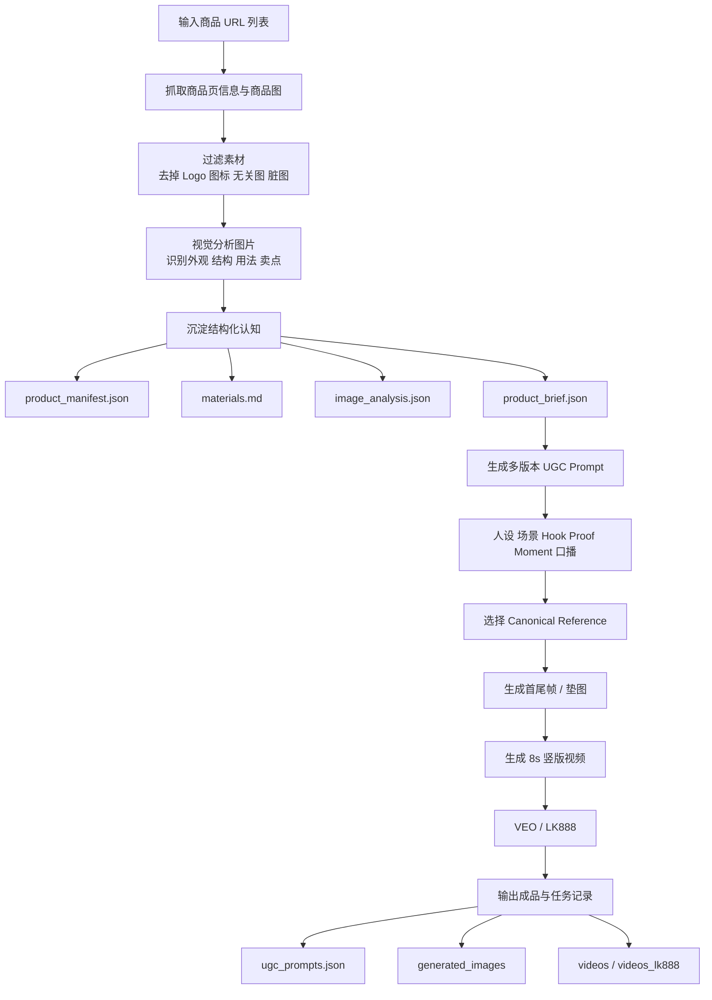

# Product UGC Pipeline Skill 介绍

## 这是什么

`product-ugc-pipeline` 是一个面向电商商品链接的 UGC 视频生产 Skill。

它的目标不是简单“抓网页 + 写几句文案”，而是把一批商品 URL 自动转换成一套可复用的视频生产资产：

- 抓取商品页与商品素材
- 过滤无关图片，只保留和产品相关的视觉素材
- 用视觉理解补足“这个产品到底是什么、怎么用、卖点是什么”
- 生成多版本 UGC Prompt
- 生成首尾帧 / 垫图
- 调用视频模型批量生成短视频
- 把全过程沉淀为可回溯、可重跑、可二次编辑的素材包

一句话概括：**这是一个“产品认知驱动”的 UGC 视频生产流水线。**

---

## 流程图

---

## 工作流程拆解

### 1. 输入：商品 URL 列表

Skill 的起点是一批电商商品链接。

系统会按 `序号-产品名` 的方式自动建立目录，方便后续批量生产和人工复核。

### 2. 抓取：商品页信息与商品图片

首先抓取商品标题、价格、页面文案、结构化产品图和页面内候选图片。

这一层不是直接把所有图都拿去生成，而是先把素材收集齐，为后面的筛选和理解做准备。

### 3. 素材过滤：只保留真正和产品相关的图片

这一步是整个流程里非常重要的基础能力。

不是商品页上的所有图片都适合喂给模型，常见问题包括：

- 店铺 Logo、支付图标、局部装饰图
- 不同 SKU 混图
- 包装图、配件图、细节裁切图
- 无法完整反映产品外观的局部图

Skill 会优先保留能反映产品真实外观、结构和功能的商品图，并把过滤后的结果沉淀下来。

### 4. 视觉理解：识别产品外观、结构、功能与使用方式

这一层不是只看网页文案，而是让模型真正“看图理解产品”。

它会尽量回答这些问题：

- 产品的真实外观是什么
- 哪张图最能代表真实全貌
- 产品有哪些关键结构和功能部位
- 它是怎么被使用的
- 什么动作一定要演对，什么动作不能演错
- 哪些图适合作为身份锁定参考图，哪些图应该避开

这一步的结果会同步写入：

- `materials.md`
- `image_analysis.json`

### 5. 构建产品认知：从素材理解升级为“可拍视频的知识”

Skill 不会直接拿识别结果硬写 Prompt，而是会先把产品认知整理成更稳定的中间层。

这一层会综合：

- `product_manifest.json`
- `image_analysis.json`

然后输出 `product_brief.json`，形成更适合后续视频生成的认知结构，例如：

- 产品身份锁定
- 确认过的使用场景
- 分步骤使用逻辑
- 适合展示的 proof moment
- 不能出错的误用风险
- 参考图选择策略

这一步的意义是：**先理解产品，再生成视频，而不是让视频模型自己猜。**

### 6. 生成多版本 UGC Prompt

接下来才进入 Prompt 生成阶段。

这里不是简单改写 10 条差不多的文案，而是会按“小功能 / 小卖点 / 小场景”拆成多个变体。

每个变体一般会包含：

- Hook
- 创作者人设
- 场景设定
- 核心功能展示动作
- Proof moment
- 口播 / 对话
- 首帧 Prompt
- 尾帧 Prompt
- 视频 Prompt
- 参考图选择

目标是让每条视频都聚焦一个清晰卖点，而不是所有视频反复拍同一件事。

### 7. 选择 Canonical Reference

这是整个 Skill 的核心亮点之一。

在生成图片和视频之前，系统会尽量选出最能反映产品真实全貌的图片作为 **canonical reference**，也就是“产品身份锁”。

它的作用不是锁定原图背景，而是锁定这些最关键的信息：

- 轮廓
- 比例
- 材质
- 结构
- 功能区
- 配色
- 连接方式
- 可见机制

这样做的目的，是尽量避免后续模型把产品：

- 变形
- 变款
- 变颜色
- 变结构
- 多出不存在的零件
- 演示错误用法

### 8. 生成首尾帧 / 垫图

在产品身份锁定后，Skill 会生成首帧和尾帧，或者生成单张垫图。

这一步不是简单“生成一张好看的图”，而是服务于视频稳定性：

- 首帧负责建立场景与动作起点
- 尾帧负责体现结果、proof moment 或 sell shot
- 两帧之间要有足够差异，能支撑 8 秒动作推进
- 同时产品外观必须保持一致

这里非常强调一条原则：

**场景可以扩展想象，但产品不能改。**

### 9. 生成视频

最后调用视频模型生成 8 秒竖版短视频。

当前这条 Skill 同时兼容：

- LaoZhang 路线
- LK888 / updrama 路线

### 10. 输出沉淀：每个商品都是一个完整资产包

每个产品最终都会形成一个完整的可复用目录，不只是一个视频文件。

这意味着后面你想：

- 换 Prompt
- 重选参考图
- 重跑图片
- 重跑视频
- 做更多变体
- 人工复核问题素材

都不需要从头开始。
