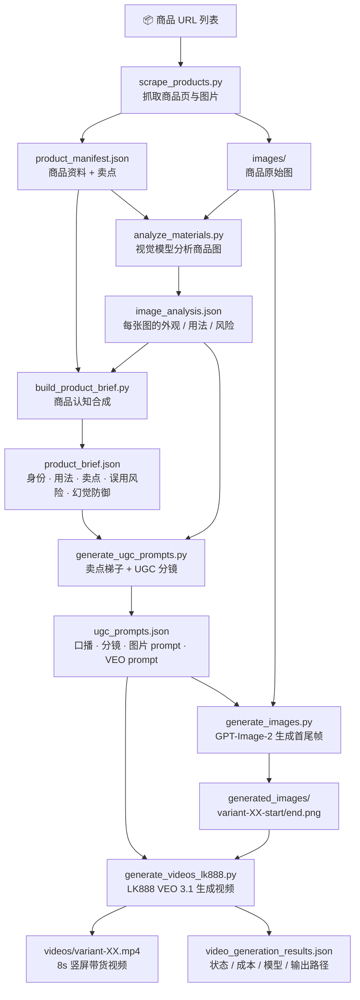
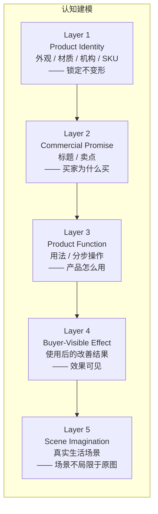
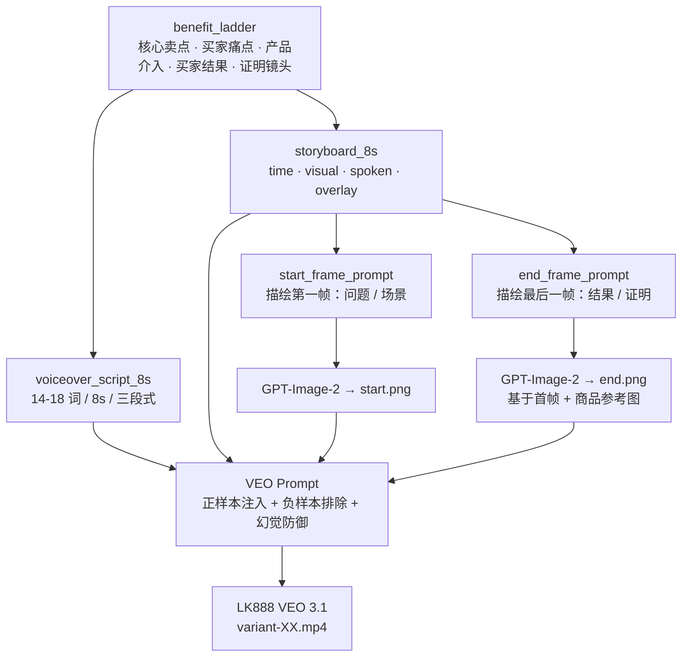
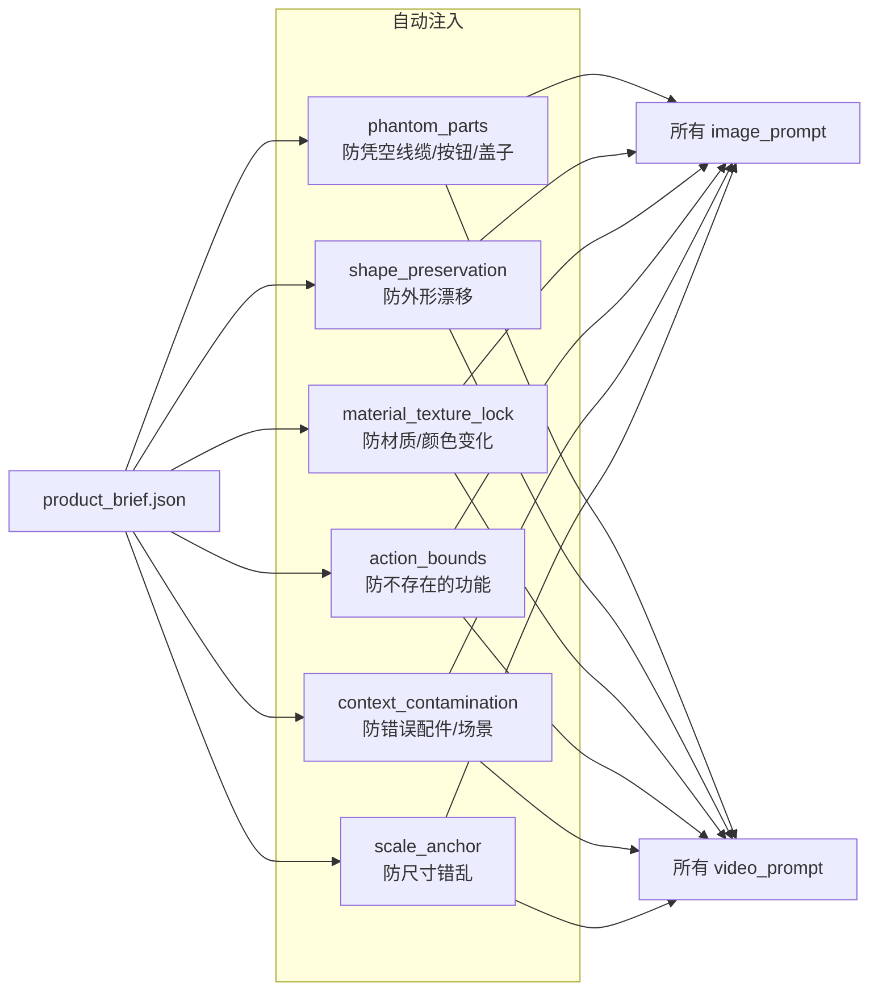

# Product UGC Pipeline Skill — PDCA 实践总结

## Plan

搭建一套 AI 驱动的电商商品 UGC 短视频生产 Skill，实现：从商品 URL 自动抓取商品页与图片素材，通过视觉模型理解产品外观与用法，合成产品认知与核心卖点，生成 10 个差异化 UGC 口播分镜与首尾帧 prompt，调用 GPT-Image-2 生成首尾帧，再通过 LK888 VEO 3.1 生成 8 秒竖屏带货视频。全程强制产品外观保真、幻觉防御、卖点梯子和口播长度约束。

## Do

用 Python 构建了 8 个生产脚本（scrape → analyze → brief → prompt → image → video → batch），接入 LaoZhang GPT-Image-2 做首尾帧生成，LK888 VEO 3.1（veo3.1）做视频生成，GPT-4o / MiniMax-M3 做视觉分析，GPT-5.2 或 Codex 直写做 prompt 生成。核心实现了：benefit_ladder 卖点梯子（core_selling_claim → buyer_problem → product_intervention → buyer_result → proof_moment），6 类通用幻觉防御自动注入（phantom_parts / shape_preservation / material_texture_lock / action_bounds / context_contamination / scale_anchor），8 秒口播约束（14-18 词，硬上限 20 词，问题→介入→结果三段式），首尾帧连续性（尾帧基于首帧 + 商品参考图生成，同场景同人物），Fail-Fast 生产契约（认知链路任何一步失败不跑付费视频），canonical 文件管理（videos/variant-XX.mp4 递增编号 + ugc_prompts.json 统一追加）。

## Check

VEO 视频中产品外观偶有漂移——花朵形洗碗刷变成普通圆刷、宠物项圈卡扣变金属扣、戒指形状变形。8 秒口播经常在结尾被截断，台词没说完。首尾帧有时场景/人物/灯光完全不同，导致视频中途画面突变。6 月中旬 omni-flash 试验期间视频质量不稳定，且 VEO 失败时脚本静默切换到 Seedance/即梦等非 VEO 模型，产出质量不可控。部分 prompt 只描述产品部件（buckle、slider、soft fabric）而不讲买家为什么买，视频好看但没抓住核心卖点。多轮追加视频时新建目录满天飞，prompt 文件和视频散落各处难以追溯。

## Act

在 `build_product_brief.py` 中为每个产品自动生成 6 类幻觉防御字段，`generate_ugc_prompts.py` 自动注入所有 prompt。将 8 秒口播硬约束写入 `VOICEOVER_TARGET_WORDS=14-18`、`VOICEOVER_HARD_MAX_WORDS=20`，并按 benefit_ladder 顺序（buyer problem → product intervention → buyer result）禁止无卖点台词如"here is how it works"。尾帧生成改为基于首帧 + 商品参考图，`SKILL.md` 中强制要求同一房间/人物/光线/机位。在 `SKILL.md` 和脚本中硬编码 VEO-first 规则，禁止静默切换到 Seedance/Kling/Omni，失败时报告具体状态和错误而非静默降级。新增 `build_benefit_ladder()` 函数，所有 variant 在写口播和分镜之前必须先确定 core_selling_claim 和 buyer_problem。统一输出为 canonical 递增编号 + `runs/` 批次历史，支持先产几条后续继续追加。
## 流程总览

## 认知建模五层

## 单条视频生成链路

## 幻觉防御六层

